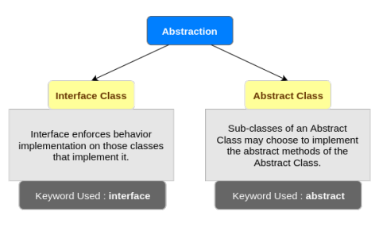

# Abstraction

Abstraction is a process of hiding the implementation details from the user. Only the functionality will be provided to the user. In Java, abstraction is achieved using abstract classes and interfaces

#### Interface and Abstract Class

* **Main differences is methods of Java interfaces are implicitly  abstract and cannot have implementations. Java abstract classes can have instance methods that implements a default behavior**
* Variables declared in a Java interface is by default final. An abstract class may contain non-final variables
* Members of a Java interface are public by default. A Java abstract class can have the usual flavors of class members like private, protected, etc
* Java interface should be implemented using keyword "implements"; A Java abstract class should be extended using keyword "extends"
* An interface can extend another Java interface only, an abstract class can extend another Java class and implement multiple Java interfaces
* A Java class can implement multiple interfaces but it can extend only one abstract class
* interface is absolutely abstract and cannot be instantiated; A java abstract class also cannot be instantiated; but can be invoked if a main\(\) exists.
* An interface can inherit multiple interfaces, and a class can implement multiple interfaces
* However, a class can only inherit one class, Java does not support multiple inheritance of class.

example

links

